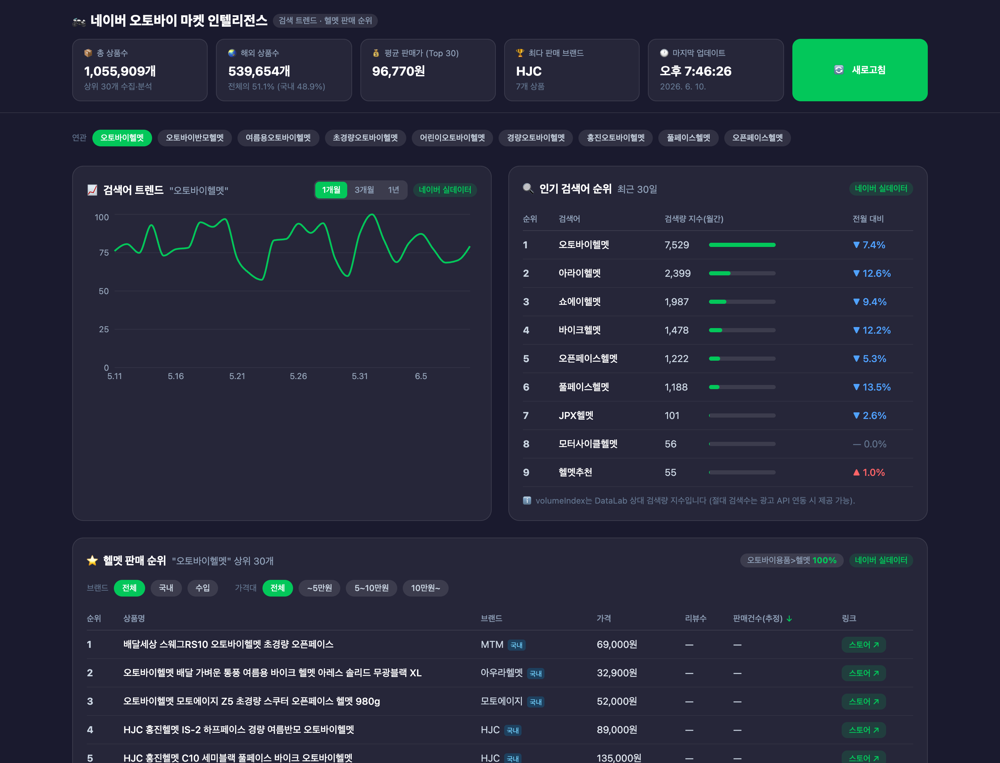
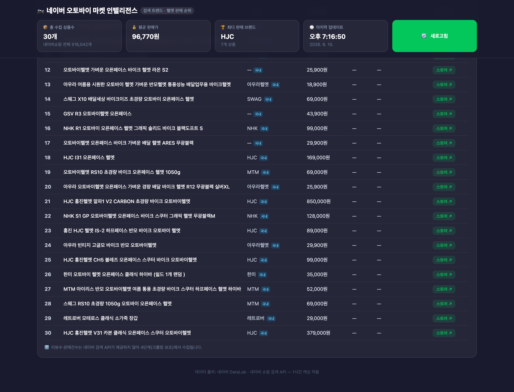
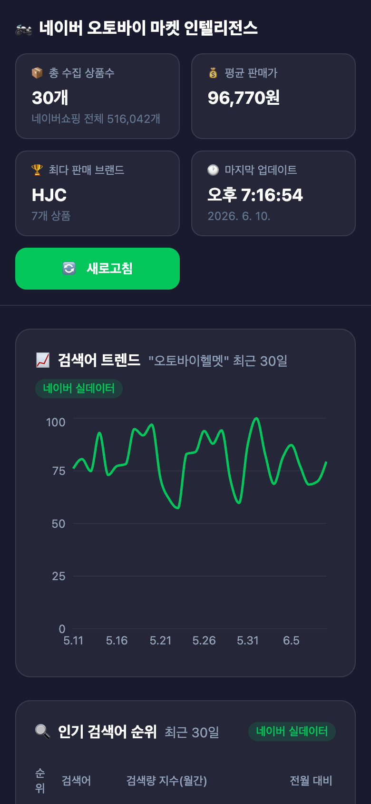

# 🏍️ 네이버 오토바이 마켓 인텔리전스 대시보드

네이버 검색어 트렌드(DataLab)와 쇼핑 헬멧 판매 순위를 매일 자동 수집·분석하여 보여주는 웹 대시보드입니다.



## 주요 기능

| 기능 | 설명 |
|------|------|
| 📈 검색어 트렌드 차트 | 검색량 추이 — 기간 토글 1개월/3개월/1년 (DataLab 쇼핑인사이트) |
| 🔍 인기 검색어 순위 | 헬멧 관련 키워드 검색량 지수 + 전월 대비 증감 (▲▼) |
| 🏷️ 연관 키워드 칩 | 클릭하면 트렌드·통계·판매 순위가 해당 키워드로 전환 |
| 🌏 시장 통계 | 총 상품수 / 해외 상품수·비율 / 카테고리 분포 (SellerLife 스타일) |
| ⭐ 헬멧 판매 순위표 | 상위 30개 — 컬럼 정렬, 브랜드(국내/수입)·가격대 필터, 어제 대비 순위 변동 뱃지 |
| 📊 요약 카드 | 총 상품수 / 평균 판매가 / 최다 브랜드 / 업데이트 시각 / 새로고침 |
| ⏰ 자동 수집 | 매일 09:00 트렌드, 09:30 판매 순위 (node-cron, Asia/Seoul) |
| 🗄️ 히스토리 | 날짜별 스냅샷 저장, `GET /api/history?days=7` |

<details>
<summary>📱 모바일 화면 / 판매 순위표 스크린샷</summary>



</details>

## 폴더 구조

```
naver-moto-dashboard/
├── frontend/        # React 18 + Vite 6 + Tailwind CSS 4 + Recharts (포트 5173)
│   └── src/
│       ├── api/         # 백엔드 호출 래퍼
│       └── components/  # 트렌드 차트, 검색어/판매 순위표, 요약 카드
├── backend/         # Node.js + Express (포트 3001)
│   ├── routes/      # /api/trends, /api/shopping/search, /api/keywords/volume, /api/history, /api/collect
│   ├── services/    # 네이버 API 클라이언트, 수집기, mock 데이터
│   └── db/          # SQLite (1시간 캐시 + 날짜별 스냅샷)
├── .env.example     # API 키 템플릿
└── README.md
```

## 🚀 설치 및 실행

```bash
# 1) 의존성 설치 (루트 + 백엔드 + 프론트엔드 한 번에)
npm run install:all

# 2) API 키 설정 (아래 발급 안내 참고 — 키 없이도 mock 데이터로 동작)
cp .env.example .env   # 후 NAVER_CLIENT_ID / SECRET 입력

# 3) 개발 모드 (백엔드 + 프론트엔드 동시 실행)
npm run dev            # → http://localhost:5173

# 프로덕션 모드
npm run build          # 프론트엔드 빌드
npm start              # → http://localhost:3001 (빌드본 + API 통합 서빙)
```

## 🔑 네이버 API 키 발급 방법

약 5분 소요, 무료입니다.

### 1. 네이버 개발자 센터 접속
1. <https://developers.naver.com> 접속 → 우측 상단 **로그인** (네이버 계정)
2. 처음이면 이용약관 동의 및 휴대폰 인증 진행

### 2. 애플리케이션 등록
1. 상단 메뉴 **Application → 애플리케이션 등록**
2. 입력 항목:

   | 항목 | 입력값 |
   |------|--------|
   | 애플리케이션 이름 | `오토바이 마켓 대시보드` (자유) |
   | 사용 API | 아래 3번의 3개 모두 추가 |
   | 비로그인 오픈 API 서비스 환경 | **WEB 설정** → `http://localhost:5173` |

### 3. 사용 API 신청 (중요 — 3개 모두)
- ✅ **검색** — 쇼핑 상품 검색 (판매 순위)
- ✅ **데이터랩 (검색어트렌드)** — 키워드 검색량
- ✅ **데이터랩 (쇼핑인사이트)** — 카테고리 클릭 트렌드

> 💡 기존 앱에 추가하려면: **내 애플리케이션 → 해당 앱 → API 설정 탭**

### 4. 키 확인 및 .env 설정
**내 애플리케이션 → 개요 탭**에서 `Client ID`, `Client Secret` 확인 후:

```
NAVER_CLIENT_ID=발급받은_Client_ID
NAVER_CLIENT_SECRET=발급받은_Client_Secret
PORT=3001
```

> ⚠️ `.env`는 Git에 커밋하지 마세요 (`.gitignore`에 등록됨).

### 호출 한도

| API | 일일 한도 | 보호 장치 |
|-----|----------|----------|
| 검색 (쇼핑) | 25,000회 | 모든 응답 SQLite 1시간 캐싱 |
| 데이터랩 | 1,000회 | 〃 + 키워드 요청 묶음(5개/회) 처리 |

## 🔌 API 엔드포인트

| 메서드 | 경로 | 설명 |
|--------|------|------|
| GET | `/api/health` | 서버 상태 + API 키 설정 여부 |
| POST | `/api/trends` | 검색어 트렌드 (최근 30일) |
| GET | `/api/shopping/search?keyword=&sort=sim\|review` | 상품 검색 (상위 30개) |
| GET | `/api/shopping/stats?keyword=` | 시장 통계 (총/해외 상품수, 카테고리 분포) |
| POST | `/api/keywords/volume` | 키워드 검색량 지수 + 전월 대비 |
| GET | `/api/history?days=7` | 날짜별 수집 히스토리 + 순위 변동 |
| POST | `/api/collect` | 수동 전체 갱신 (캐시 무시 + 스냅샷 저장) |

## 참고 사항

- **mock 모드**: API 키 미설정 시 모든 데이터가 일관된 mock으로 대체되어 UI 개발이 가능합니다. 화면의 출처 뱃지(`네이버 실데이터`/`mock 데이터`)로 구분됩니다.
- **리뷰수·판매건수**: 네이버 검색 API가 제공하지 않는 필드로, 현재 `—` 표시됩니다. (Puppeteer 크롤링 보조로 확장 가능 — robots.txt 준수, 요청 간격 1~2초 필요)
- **검색량 지수**: DataLab은 상대값(0~100 정규화)만 제공합니다. 절대 월간 검색수가 필요하면 네이버 광고 API(별도 키) 연동으로 업그레이드할 수 있습니다.
- **순위 변동 뱃지**: 스냅샷이 2일치 이상 쌓이면 판매 순위표에 ▲▼/NEW 뱃지가 자동 표시됩니다.

## 단계별 진행 상황

- [x] 1단계: 프로젝트 기반 세팅
- [x] 2단계: 네이버 API 연동 (DataLab 트렌드 / 쇼핑 검색 / 키워드 검색량)
- [x] 3단계: 프론트엔드 대시보드 UI
- [x] 4단계: 데이터 수집 자동화 (스케줄러, 히스토리, 순위 변동)
- [x] 5단계: 통합 실행 스크립트 및 배포 준비
